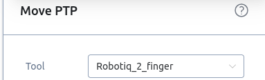
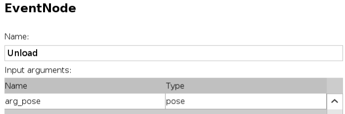
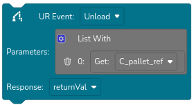
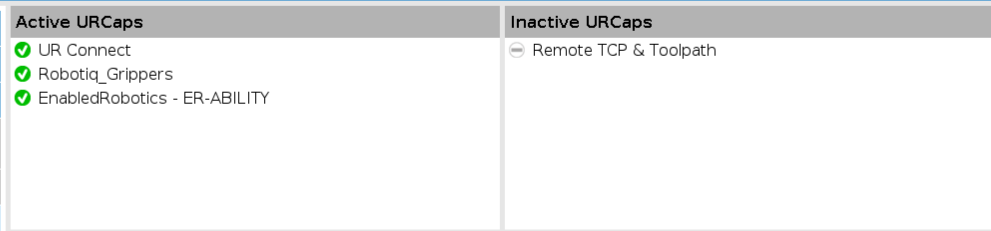
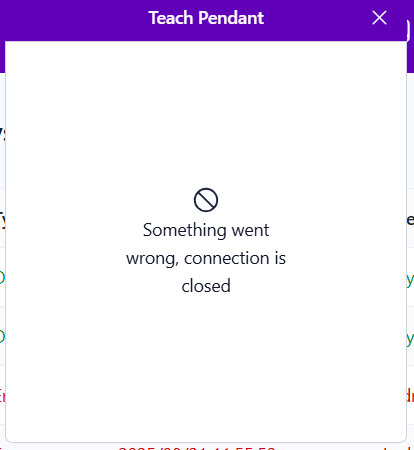

# ER-FLEX progress documentation

## Passwords
Used are the following credentials:

**ER web interface** username: admin, password: admin  
**MiR web interface** username: admin, password: admin  
**UR Safety** pssword: enabled  
**UR Admin** password: easybot  
*A pasword* that showed up while updating PolyScope and that we have never used: LogMeIn  

## Network setup
Both robots  are configured to connect to a network with the following credentials: SSID: HR_department, password: *hidden*.
There are two web interfaces for each robot, see table below:

| Robot | Hostname | ER interface IP | MiR interface IP |
| - | - | - | - |
| Asimo | ASIMO-er-flex-250 | / | / |
| Bane | BANE-er-flex-250 | / | / |

### Networking troubleshooting
TODO @nkymark

**MiR interface**
Dedicated to the MiR moblie platform. Used for creating maps, defining poses for robot, defining charginig dock, managing MiR features (e.g. sounds).

**Enabled Robotics interface**
For managing the robot whole. Creating programs for the robot, creating missions, remotely accessing the UR teach pendant.

## Starting the robot
For the robot to be fully started, both MiR cart and UR5 must be on.
- Turn on them MiR by pressing the button in the lower left corner of the back side
- Turn on the UR5 arm by pressing button on the teach pendant. Wait for the robot to boot and then activate the arm using the teach pendant.
- Once the button on the back side starts flashing blue, press it to release the parking brake.
Manufacturers documentation [here](original_documentation/3.1.0-er-flex-250-user-manual.pdf)

<mark>Important:</mark> The cart won't move unless the arm is in its **Safe Home position**. 

## Changes made to the robot
* New TCP of the UR5 has been created, accounting for the mounted gripper. This TCP has been set as default to the 'default' installation of the robot. This has to be taken into account when programming arm movements with the blocks in the ER web interface, as the default TCP (Tool) for the movement blocks is 'Flange', which is different than the modified TCP. Instead, the TCP (Tool) **Robotiq_2_finger** should be used.

<mark>TL;DR</mark> When programming arm movements using blocks, set the ``Tool`` option to **Robotiq_2_finger**.

* Both robots have been [updated](#updating-the-robot) as described below

## Creating a program
You can "write" the main program in the ER web interface using blocks. To interact with the gripper and command the UR5 to do things other than moving, the UR Event block can be used. The UR Events can be defined in the 'ability' script. Manufacturers documentation [here](original_documentation/ability-2.14.0-user-docs.pdf)

### Ability script
This is a script for managing the UR5 manipulator actions. It can be accessed via the Teach pendant. THe script *should* start automatically when switching to 'remote' mode.
EventNodes can be added to the script to execute manipulator tasks. The nodes can then be launched from the main program (blocks). The node can take arguments passed from the main program, it is important to set the correct datatype. If you are using more parameters, they should be passed in as a list.
 

## Running a program
To run the program switch the UR to 'remote' mode, wait for the 'ability' script to start, make sure the gripper is activated and then launch the main program. Alternatively, you can start the "ability" manually in local mode and switch to remote afterwards.

### Two stations paletitzing program
This program is saved on Bane robot.
In this program, the robot drives to first station and detects pallet with workpieces using the camera mounted on the UR5. Then the robot moves above the pallet and sends its relative position as a parameter of UR Event. In the UR Event the robot calculates the positions of three workpieces and moves them into the pallet on the MiR platform. Then drives to second position, where it detects a pallet to unload the workpieces and unloads them. Then the robot returns to the first position. The UR Events used are  ``Paletize`` and ``Unload``. These must be included in the ability script for the program to run.

#### Running in different enviroment
You will need to define two safe positions for the MiR, the UR5 will try to detect the pallet to the right side of the robot. To change that, edit 'A_calibrate' and 'B_calibrate' waypoints in the program.

## Encountered problems (and solutions)
- **Teach pendant in the ER interface won't open** If a window showing an error opens after clicking the pendant icon, make sure the UR5 is on and active. If nothing happends after clicking, refresh the page. If that doesn't help, clear the browser data, (cookies, etc.) and try again.

- **Ability script doesn't start after switching to remote mode** 
We don't know what exactly causes the problem. Possible solutions, that sometimes work: 
1. Wait for a bit (up to a minute), sometimes it just takes longer.
2. Switch to 'local' mode, start the script so the variables appear, stop the script and then switch to 'remote'.
3. Switch to 'local' mode, star the script, let it running and switch to 'remote'. Wait for the script to stop and start again automatically. The main program (blocks) will not work when the script is started manually, you have to wait for the script to restart.
4. Reboot the UR5 and try again.

- **MiR mobile platform won't drive** Check if the MiR is paused in the MiR web interface. Check if the UR5 manipiulator is in 'Safe Home' position. Check if any of the ``Emergency-stop`` buttons is pressed. Check if something is near the robot (20 cm) and can be detected by the lidar, for example the teach pendant cable. If after this the problem persists, use the Teach Pendant to check if Safe Home and Home position is synchronized. Navigate to Instalation -> Safety -> Safe Home, enter safety password (enabled) and click Sync from Home.

## Original documentation
Useful documentation provided by the suplier can be found in the [original documentation](original_documentation/) folder.

##  Starting 'ability' script problem
We are having problems with the ER-Flex robot. We expect the “ability” script of the UR manipulator to be started and enable the main program to use the defined EventNodes when switching to ‘remote’ mode. However the behavior of the script is inconsistent. Often after switching to ‘remote’ mode, the ‘ability’ script takes up to a minute to start, or doesn’t start at all.
We made sure the manipulator is fully activated and can be operated in ‘local’ mode, also that the safety stop is released.
We added a total of four EventNodes to the ‘ability’ script. The script itself can be seen below.
We suspected the problem might be caused by the length of the script, but it kept occurring even after deleting parts of the program (making it shorter) and reducing the number of EventNodes.
This Issue keeps appearing unpredictably. Sometimes switching between ‘local’ and ‘remote’ mode a few times helps to start the script. Starting the script in ‘local’ mode and then switching to ‘remote’ also helped.
However we didn’t find any persistent cause of the issue, nor a reliable solution.

### Solution
Updating the system, as described below.

## Updating the robot
As a solution to the problem with starting 'ability' script, described above, we updated the robot software, the process is described below, divided into parts:

### ER software
In the web interface, navigate to System -> Settings -> Software update, in the 'Cloud' section select version of the software an click 'Download'. Once the download is finished, Select the new version in the 'Software Update' section and click Apply. Then turn the whole robot off and on again. Make sure the robot is not charging when doing so. After restart, the software should be updated and the new version will be visible in the lower left corner of the web interface. The process is also described in [original guide](original_documentation/HTG-HOW%20TO_%20Update%20Ability%20for%20versions%202.0.0%20and%20newer-200825-115545.pdf)

### PolyScope (UR manipulator software)
Download the desired version of PolyScope from UR Download center. Newest versions can be found on [Download center](https://www.universal-robots.com/download/?filters[]=98763&query=) page, older versions on the [Legacy download center](https://www.universal-robots.com/articles/ur/documentation/legacy-download-center/).
Place the downloaded file to root directory of a USB drive, turn on and activate the UR and plug the USB into the Teach Pendant. Navigate to Settings (top right corner), 

### ER URCap
URCap is a plugin for PolyScope enabling communication. After updating ER software and PolyScope, you might get prompted to update the URCap. If you do, just click 'yes' and it will update automatically, othervise proceed.
You can check that the URCap has been updated by navigating to Settings -> General -> URCaps. All installed plugins will be visible there.

### VNC server
To see Teach Pendant screen in the web interface, VNC server needs to be installed on the UR. The VNC server is deleted when updating PolyScope and must be installed back. If you open teach pendant in the web interface and see this, you need to reinstall it.

Place files found in [VNC_server](VNC_server/) directory to the root directory of a USB drive. The files canalso be found on the [ER website](https://www.enabled-robotics.com/downloadcenter) under Software -> VNC-Server.
Turn on and activate the manipulator, plug in the USB drive and wait for green text saying 'installation finished' to appear. If the installation doesnt start, make sure the feature 'magic install' is enabled in the settings. Once installation is done, unplug the USB and reboot the robot. Teach pendant should now be accesable from the web interface.

## Backup
Backup of all of the software can be found in the [programs](programs/) folder, separately for each robot and also divided to main programs and UR manipulator programs.